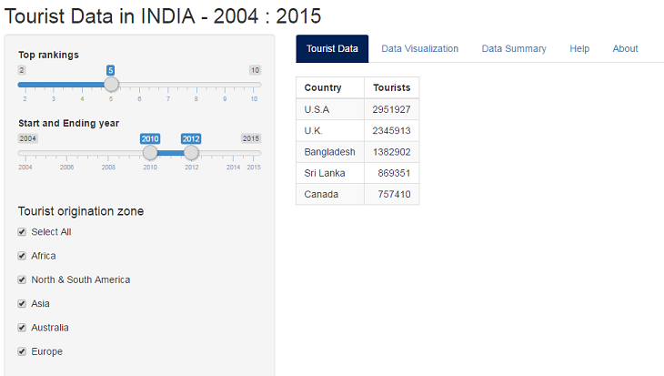
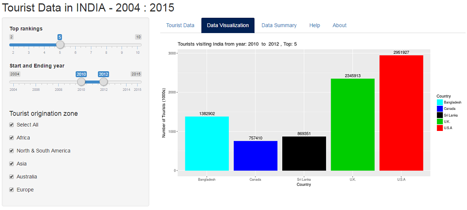
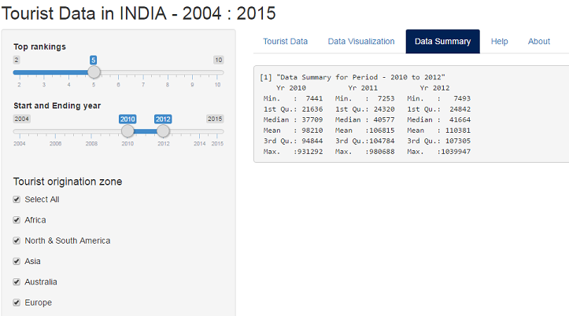

## Introduction - Growth of Tourism in India
### Coursera - Developing Data Products - Assignment

Tourism in India is growing rapidly. The World Travel & Tourism Council calculated that tourism generated in year 2016 is US$220 billion.

About 8.89 million foreign tourists arrived in India in 2016 compared to 8.027 million in 2015, recording a growth of 10.7%. 

The Travel & Tourism Competitiveness Report 2017 ranks India 40th out of 136 countries overall. The report ranks the price competitiveness of India's tourism sector 10th out of 136 countries.

The country also scores high on natural and cultural resources (ranked 9th).

--- .class #id 

## Assignment: Objective 1

To create a Shiny Application - 
* should be at the Shiny website itself.
* include enough documentation so that a novice user could use your application.
* that functions as described in the documentation.
* with some form of widget inputs (slider, textbox, radio buttons, checkbox etc) in either ui.R or a custom web page application.
* that perform some calculations on the input in server.R
* reactive output displayed as a result of server calculations

**Shiny Application:** https://sanjaysomraj.shinyapps.io/assignment03/

--- 

## Assignment: Objective 2
Get 5 slides (inclusive of the title slide) to pitch a your app. You're going to create a web page using Slidify or Rstudio Presenter with an html5 slide deck.

The presentation must satisfy the following:
* It must be done in Slidify or Rstudio Presenter
* It must be 5 pages
* It must be hosted on github or Rpubs
* It must contained some embedded R code that gets run when slidifying the document

**Slidify Presentation:**  
https://sanjaysomraj.github.io/DevelopingDataProducts_Assignment3/Assignment3Slides/index.html

**Github Repository:**  
https://github.com/SanjaySomraj/DevelopingDataProducts_Assignment3

---

## Shiny application: Foreign Tourist Arrival

This Shiny app has 5 Tab panels

1.   **Tourist Data** & **Data Visualization** tabs: Provides foreign tourist arrivals period selected and the geographical continent/zone of the tourist.
2.   **Data Summary** tab: Statistical summary of the foreign tourist arrivals.
3.   **Help** tab: General help on how to use the Shiny app.
4.   **About** tab: Information about Tourism in India and references from where the data for this assignment has been sourced.

---

## Tourist Data

---

## Data Visualization

---

## Data Summary

---

## Data source

The data for this assignment has been sourced from-

1)   MARKET RESEARCH AND STATISTICS, Ministry of Tourism, Government of India.
*    http://tourism.gov.in/market-research-and-statistics

2)   Tourism in India from Wikipedia
*    https://en.wikipedia.org/wiki/Tourism_in_India

---

## 

